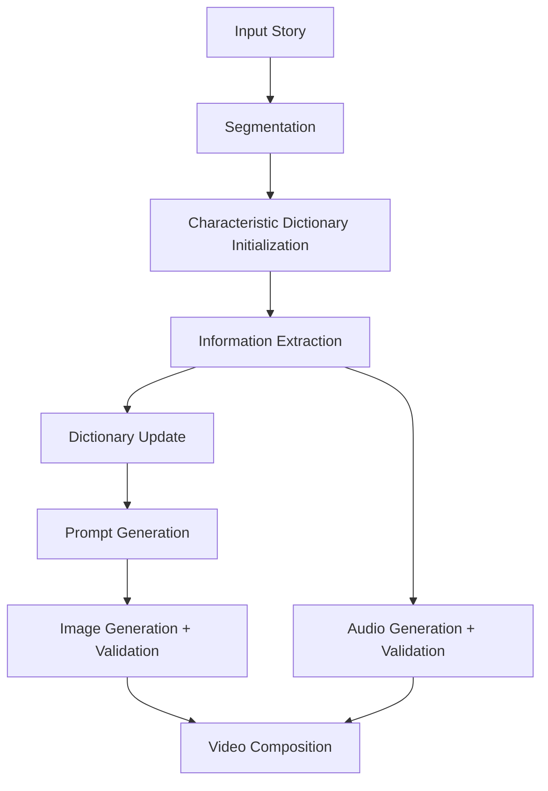

# 🎬 Narrative Video Generation Pipeline

> Generate coherent narrative videos from text using a scalable AI-driven pipeline.

---

## 🚀 Overview

This project implements a **modular pipeline for generating narrative videos from written stories** using generative AI.

Instead of generating videos directly, the system decomposes the task into structured steps:

* Story understanding
* Scene generation
* Image synthesis
* Audio narration
* Coherence validation

The result is a **synchronized video composed of images and narration**, with strong **character and scene consistency**.

---

## ✨ Features

* 📖 **Story-to-Video Generation**
* 🧠 **Context-aware scene segmentation**
* 👥 **Character consistency via dynamic state tracking**
* 🖼️ **High-quality image generation with validation loops**
* 🔊 **Multilingual text-to-speech narration**
* 📊 **Custom evaluation metric (VAC, IQS, AQS)**
* ⚡ **Parallelized generation (scalable with GPUs)**

---

## 🧩 Pipeline Architecture



---

## ⚙️ How It Works

### 1. Segmentation

* Splits the story into **semantic scenes** using an LLM.

### 2. Characteristic Dictionary

* Stores:

  * Character appearance
  * Scene description
  * Visual style
* Acts as a **memory system** for consistency.

### 3. Information Extraction

* Extracts:

  * Scene details
  * Character actions
  * Initial prompts

### 4. Context Updates

* Detects changes in:

  * Characters
  * Environment
* Updates the dictionary dynamically.

### 5. Prompt Generation

* Builds **rich prompts** combining:

  * Current segment
  * Character descriptions
  * Scene context

### 6. Image Generation

* Uses T2I models
* Applies **coherence validation loop**:

  * Regenerates images if mismatch is detected

### 7. Audio Generation

* Converts each segment into narration (TTS)

### 8. Validation

* Audio → transcribed → compared with original text
* Images → validated with semantic similarity

### 9. Video Composition

* Combines:

  * Images
  * Audio
  * Transitions

---

## 🤖 Models Used

| Task           | Model                          |
| -------------- | ------------------------------ |
| LLM            | GPT-4o                         |
| Text-to-Image  | Stable Diffusion 3.5, DALL·E 3 |
| Text-to-Speech | CoquiTTS                       |
| Speech-to-Text | Whisper Large V3 Turbo         |
| Embeddings     | CLIP                           |

---

## 📏 Evaluation Metrics

We propose a **Composite Metric (CM)**:

```
CM = α·VAC + β·IQS + γ·AQS
```

### Components:

* **VAC (Visual-Audio Coherence)**

  * Measures semantic alignment between text, images, and audio

* **IQS (Image Quality Score)**

  * Based on BRISQUE (perceptual quality)

* **AQS (Audio Quality Score)**

  * Based on WER (transcription accuracy)

---

## 🧪 Experiments

* ✅ Tested on **10 stories**
* 📚 Length range: **77 → 8651 words**
* 🌍 Multiple genres & languages
* ☁️ Infrastructure:

  * AWS EC2 (GPU instances)
  * Parallel generation with load balancing

---

## 📊 Results

### ✅ Strengths

* Strong **character & scene consistency**
* High **text-image-audio alignment (VAC)**
* Scalable to **long narratives**
* Modular and extensible design

### ⚠️ Limitations

* Heavy reliance on **large LLMs**
* High **computational cost**
* Sensitive to **prompt quality**
* Static scenes are harder to represent visually

---

## ⚡ Scalability

* Parallel image generation using multiple GPU instances
* Load balancing across workers
* Adjustable parameters:

  * Similarity threshold (τ)
  * Max regenerations (α)
  * Segment size (β)

---

## 🔮 Future Work

* Reduce dependency on large LLMs
* Improve temporal consistency across scenes
* Integrate video diffusion models
* Optimize cost vs quality trade-offs

---

## 📽️ Output

The system generates:

* A **fully narrated video**
* Scene-by-scene images
* Synchronized audio
* Smooth transitions

---

## 📌 Notes

This project was developed as part of a research project on:

> *Automatic Generation of Coherent Narrative Videos from Written Stories using Generative AI*

